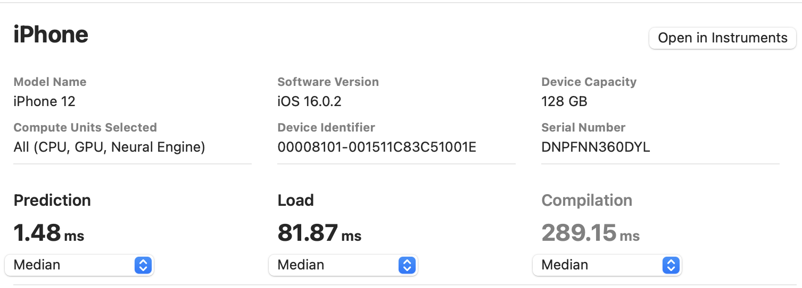
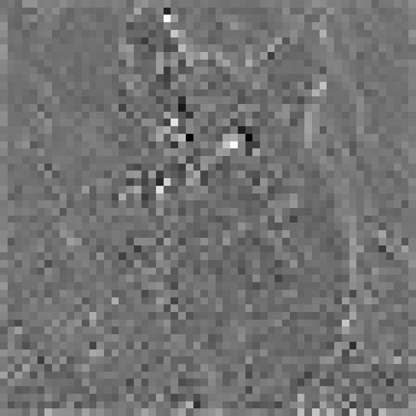
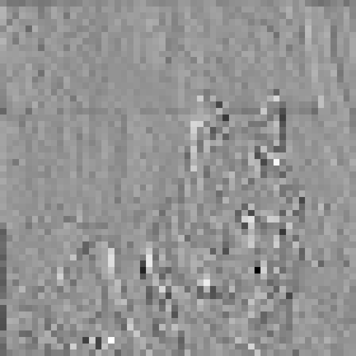
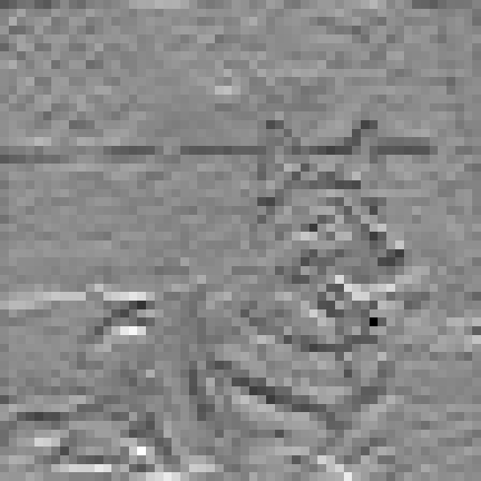

# [RepNeXt: A Fast Multi-Scale CNN using Structural Reparameterization](https://arxiv.org/abs/2406.16004)

<p align="center">
   <br>
  The top-1 accuracy is tested on ImageNet-1K and the latency is measured by an iPhone 12 with iOS 16 across 20 experimental sets.
</p>

[RepNeXt: A Fast Multi-Scale CNN using Structural Reparameterization](https://arxiv.org/abs/2406.16004).\
Mingshu Zhao, Yi Luo, and Yong Ouyang
[[`arXiv`](https://arxiv.org/abs/2406.16004)]


<details>
  <summary>
  <font size="+1">Abstract</font>
  </summary>
    We introduce RepNeXt, a novel model series integrates multi-scale feature representations and incorporates both serial and parallel structural reparameterization (SRP) to enhance network depth and width without compromising inference speed.
    Extensive experiments demonstrate RepNeXt's superiority over current leading lightweight CNNs and ViTs, providing advantageous latency across various vision benchmarks.
    RepNeXt-M4 matches RepViT-M1.5's 82.3% accuracy on ImageNet within 1.5ms on an iPhone 12, outperforms its AP$^{box}$ by 1.1 on MS-COCO, and reduces parameters by 0.7M.
</details>

<br/>


## Classification on ImageNet-1K

### Models

| Model | Top-1 (300)| #params | MACs | Latency | Ckpt | Core ML |                    Log                     |
|:------|:----:|:---:|:--:|:-------:|:--:|:--:|:------------------------------------------:|
| M1  |   78.8   |     4.8M    |   0.8G   | 0.86ms  | [300e](https://github.com/suous/RepNeXt/releases/download/v1.0/repnext_m1_distill_300e.pth) |   [300e](https://github.com/suous/RepNeXt/releases/download/v1.0/repnext_m1_distill_300e_224.mlmodel)   | [distill 300e](./logs/repnext_m1_distill_300e.txt) / [300e](./logs/repnext_m1_without_distill_300e.txt)|
| M2  |   80.1   |     6.5M    |   1.1G   | 1.00ms  | [300e](https://github.com/suous/RepNeXt/releases/download/v1.0/repnext_m2_distill_300e.pth) |   [300e](https://github.com/suous/RepNeXt/releases/download/v1.0/repnext_m2_distill_300e_224.mlmodel)   | [distill 300e](./logs/repnext_m2_distill_300e.txt) / [300e](./logs/repnext_m2_without_distill_300e.txt)|
| M3  |   80.7   |     7.8M    |   1.3G   | 1.11ms  | [300e](https://github.com/suous/RepNeXt/releases/download/v1.0/repnext_m3_distill_300e.pth) |   [300e](https://github.com/suous/RepNeXt/releases/download/v1.0/repnext_m3_distill_300e_224.mlmodel)   | [distill 300e](./logs/repnext_m3_distill_300e.txt) / [300e](./logs/repnext_m3_without_distill_300e.txt)|
| M4  |   82.3   |     13.3M   |   2.3G   | 1.48ms  | [300e](https://github.com/suous/RepNeXt/releases/download/v1.0/repnext_m4_distill_300e.pth) |   [300e](https://github.com/suous/RepNeXt/releases/download/v1.0/repnext_m4_distill_300e_224.mlmodel)   | [distill 300e](./logs/repnext_m4_distill_300e.txt) / [300e](./logs/repnext_m4_without_distill_300e.txt)|
| M5  |   83.3   |     21.7M   |   4.5G   | 2.20ms  | [300e](https://github.com/suous/RepNeXt/releases/download/v1.0/repnext_m5_distill_300e.pth) |   [300e](https://github.com/suous/RepNeXt/releases/download/v1.0/repnext_m5_distill_300e_224.mlmodel)   | [distill 300e](./logs/repnext_m5_distill_300e.txt) / [300e](./logs/repnext_m5_without_distill_300e.txt)|


Tips: Convert a training-time RepNeXt into the inference-time structure
```
from timm.models import create_model
import utils

model = create_model('repnext_m1')
utils.replace_batchnorm(model)
```

## Latency Measurement 

The latency reported in RepNeXt for iPhone 12 (iOS 16) uses the benchmark tool from [XCode 14](https://developer.apple.com/videos/play/wwdc2022/10027/).


<details>
<summary>
RepNeXt-M1
</summary>

</details>

<details>
<summary>
RepNeXt-M2
</summary>

</details>

<details>
<summary>
RepNeXt-M3
</summary>

</details>

<details>
<summary>
RepNeXt-M4
</summary>

</details>

<details>
<summary>
RepNeXt-M5
</summary>

</details>

Tips: export the model to Core ML model
```
python export_coreml.py --model repnext_m1 --ckpt pretrain/repnext_m1_distill_300e.pth
```
Tips: measure the throughput on GPU
```
python speed_gpu.py --model repnext_m1
```


## ImageNet  

### Prerequisites
`conda` virtual environment is recommended. 
```
conda create -n repnext python=3.8
pip install -r requirements.txt
```

### Data preparation

Download and extract ImageNet train and val images from http://image-net.org/. The training and validation data are expected to be in the `train` folder and `val` folder respectively:

```bash
# script to extract ImageNet dataset: https://github.com/pytorch/examples/blob/main/imagenet/extract_ILSVRC.sh
# ILSVRC2012_img_train.tar (about 138 GB)
# ILSVRC2012_img_val.tar (about 6.3 GB)
```

```
# organize the ImageNet dataset as follows:
imagenet
├── train
│   ├── n01440764
│   │   ├── n01440764_10026.JPEG
│   │   ├── n01440764_10027.JPEG
│   │   ├── ......
│   ├── ......
├── val
│   ├── n01440764
│   │   ├── ILSVRC2012_val_00000293.JPEG
│   │   ├── ILSVRC2012_val_00002138.JPEG
│   │   ├── ......
│   ├── ......
```

### Training
To train RepNeXt-M1 on an 8-GPU machine:

```
python -m torch.distributed.launch --nproc_per_node=8 --master_port 12346 --use_env main.py --model repnext_m1 --data-path ~/imagenet --dist-eval
```
Tips: specify your data path and model name! 

### Testing 
For example, to test RepNeXt-M1:
```
python main.py --eval --model repnext_m1 --resume pretrain/repnext_m1_distill_300e.pth --data-path ~/imagenet
```

## Downstream Tasks
[Object Detection and Instance Segmentation](detection/README.md)<br>

| Model      | $AP^b$ | $AP_{50}^b$ | $AP_{75}^b$ | $AP^m$ | $AP_{50}^m$ | $AP_{75}^m$ | Latency |                                       Ckpt                                        |                     Log                     |
|:-----------|:------:|:---:|:--:|:------:|:--:|:--:|:-------:|:---------------------------------------------------------------------------------:|:-------------------------------------------:|
| RepNeXt-M3 |  40.8  | 62.4   | 44.7  | 37.8   | 59.5  | 40.6 |  5.1ms  | [M3](https://github.com/suous/RepNeXt/releases/download/v1.0/repnext_m3_coco.pth) | [M3](./detection/logs/repnext_m3_coco.json) |
| RepNeXt-M4 |  42.9  | 64.4   | 47.2  |  39.1  | 61.7  | 41.7 |  6.6ms  | [M4](https://github.com/suous/RepNeXt/releases/download/v1.0/repnext_m4_coco.pth) | [M4](./detection/logs/repnext_m4_coco.json) |
| RepNeXt-M5 |  44.7  | 66.0   | 49.2  |  40.7  | 63.5  | 43.6 | 10.4ms  | [M5](https://github.com/suous/RepNeXt/releases/download/v1.0/repnext_m5_coco.pth) | [M5](./detection/logs/repnext_m5_coco.json) |

[Semantic Segmentation](segmentation/README.md)

| Model      | mIoU | Latency |                                        Ckpt                                         |                       Log                        |
|:-----------|:----:|:-------:|:-----------------------------------------------------------------------------------:|:------------------------------------------------:|
| RepNeXt-M3 |   40.6   |  5.1ms  | [M3](https://github.com/suous/RepNeXt/releases/download/v1.0/repnext_m3_ade20k.pth) | [M3](./segmentation/logs/repnext_m3_ade20k.json) |
| RepNeXt-M4 |   43.3   |  6.6ms  | [M4](https://github.com/suous/RepNeXt/releases/download/v1.0/repnext_m4_ade20k.pth) | [M4](./segmentation/logs/repnext_m4_ade20k.json) |
| RepNeXt-M5 |   45.0   | 10.4ms  | [M5](https://github.com/suous/RepNeXt/releases/download/v1.0/repnext_m5_ade20k.pth) | [M5](./segmentation/logs/repnext_m5_ade20k.json) |

## Feature Map Visualization
Run feature map visualization demo using [Colab notebook](https://colab.research.google.com/github/suous/RepNeXt/blob/main/demo/feature_map_visualization.ipynb):

<table border=0 align=center>
	<tbody>
    <tr>
			<td align="center"> Original Image </td>
			<td align="center"> Identity </td>
			<td align="center"> RepDWConvS </td>
			<td align="center"> RepDWConvM </td>
			<td align="center"> DWConvL </td>
		</tr>
		<tr>
			<td width="20%">  </td>
			<td width="20%">  </td>
            <td width="20%">  </td>
            <td width="20%">  </td>
            <td width="20%">  </td>
		</tr>
		<tr>
			<td width="20%">  </td>
			<td width="20%">  </td>
            <td width="20%">  </td>
            <td width="20%">  </td>
            <td width="20%">  </td>
		</tr>
	</tbody>
</table>

## Acknowledgement

Classification (ImageNet) code base is partly built with [LeViT](https://github.com/facebookresearch/LeViT), [PoolFormer](https://github.com/sail-sg/poolformer), [EfficientFormer](https://github.com/snap-research/EfficientFormer),  and [RepViT](https://github.com/THU-MIG/RepViT)

The detection and segmentation pipeline is from [MMCV](https://github.com/open-mmlab/mmcv) ([MMDetection](https://github.com/open-mmlab/mmdetection) and [MMSegmentation](https://github.com/open-mmlab/mmsegmentation)). 

Thanks for the great implementations! 

## Citation

If our code or models help your work, please cite our paper:
```BibTeX
@misc{zhao2024repnext,
      title={RepNeXt: A Fast Multi-Scale CNN using Structural Reparameterization},
      author={Mingshu Zhao and Yi Luo and Yong Ouyang},
      year={2024},
      eprint={2406.16004},
      archivePrefix={arXiv},
      primaryClass={cs.CV}
}
```
