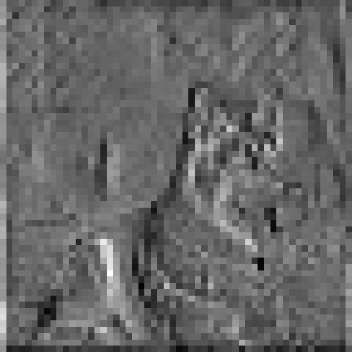

# [RepNeXt: A Fast Multi-Scale CNN using Structural Reparameterization](https://arxiv.org/abs/2406.16004)

[](https://github.com/suous/RepNeXt/blob/main/LICENSE)
[](https://arxiv.org/abs/2406.16004)
[](https://colab.research.google.com/github/suous/RepNeXt/blob/main/demo/feature_map_visualization.ipynb)

<p align="center">
   <br>
  The top-1 accuracy is tested on ImageNet-1K and the latency is measured by an iPhone 12 with iOS 16 across 20 experimental sets.
</p>

[RepNeXt: A Fast Multi-Scale CNN using Structural Reparameterization](https://arxiv.org/abs/2406.16004).\
Mingshu Zhao, Yi Luo, and Yong Ouyang
[[`arXiv`](https://arxiv.org/abs/2406.16004)]


## Abstract

We introduce RepNeXt, a novel model series integrates multi-scale feature representations and incorporates both serial and parallel structural reparameterization (SRP) to enhance network depth and width without compromising inference speed.
Extensive experiments demonstrate RepNeXt's superiority over current leading lightweight CNNs and ViTs, providing advantageous latency across various vision benchmarks.
RepNeXt-M4 matches RepViT-M1.5's 82.3% accuracy on ImageNet within 1.5ms on an iPhone 12, outperforms its AP$^{box}$ by 1.3 on MS-COCO, and reduces parameters by 0.7M.


<details>
  <summary>
  <font size="+1">Conclusion</font>
  </summary>
    In this paper, we introduced a multi-scale depthwise convolution integrated with both serial and parallel SRP mechanisms, enhancing feature diversity and expanding the network’s expressive capacity without compromising inference speed. 
    Specifically, we designed a reparameterized medium-kernel convolution to imitate the human foveal vision system. 
    Additionally, we proposed our light-weight, general-purpose RepNeXts that employed the distribute-transform-aggregate design philosophy across inner-stage blocks as well as downsampling layers, achieving comparable or superior accuracy-efficiency trade-off across various vision benchmarks, especially on downstream tasks. 
    Moreover, our flexible multi-branch design functions as a grouped-depthwise convolution with additional inductive bias and efficiency trade-offs. 
    It can also be reparameterized into a single-branch large-kernel depthwise convolution, enabling potential optimization towards different accelerators.

For example, the large-kernel depthwise convolution can be accelerated by the implicit GEMM algorithm: `DepthWiseConv2dImplicitGEMM` of [RepLKNet](https://github.com/DingXiaoH/RepLKNet-pytorch).

Many token mixers can be generalized as a **distribute-transform-aggregate** process:

| Token Mixer | Distribution |   Transforms   | Aggregation |
|:-----------:|:------------:|:--------------:|:-----------:|
|  ChunkConv  |    Split     | Conv, Identity |     Cat     |
|  CopyConv   |    Clone     |      Conv      |     Cat     |
|   MixConv   |    Split     |      Conv      |     Cat     |
|    MHSA     |    Split     |      Attn      |     Cat     |
|  RepBlock   |    Clone     |      Conv      |     Add     |

`ChunkConv` and `CopyConv` can be viewed as grouped depthwise convolutions.

- **Chunk Conv**

```python
class ChunkConv(nn.Module):
    def __init__(self, in_channels, bias=True):
        super().__init__()
        self.bias = bias
        in_channels = in_channels // 4
        kwargs = {"in_channels": in_channels, "out_channels": in_channels, "groups": in_channels, "bias": bias}
        self.conv_i = nn.Identity()
        self.conv_s = nn.Conv2d(kernel_size=3, padding=1, **kwargs)
        self.conv_m = nn.Conv2d(kernel_size=7, padding=3, **kwargs)
        self.conv_l = nn.Conv2d(kernel_size=11, padding=5, **kwargs)

    def forward(self, x):
        i, s, m, l = torch.chunk(x, chunks=4, dim=1)
        return torch.cat((self.conv_i(i), self.conv_s(s), self.conv_m(m), self.conv_l(l)), dim=1)

    @torch.no_grad()
    def fuse(self):
        conv_s_w, conv_s_b = self.conv_s.weight, self.conv_s.bias
        conv_m_w, conv_m_b = self.conv_m.weight, self.conv_m.bias
        conv_l_w, conv_l_b = self.conv_l.weight, self.conv_l.bias

        conv_i_w = torch.nn.functional.pad(torch.ones(conv_l_w.shape[0], conv_l_w.shape[1], 1, 1), [5, 5, 5, 5])
        conv_s_w = nn.functional.pad(conv_s_w, [4, 4, 4, 4])
        conv_m_w = nn.functional.pad(conv_m_w, [2, 2, 2, 2])

        in_channels = self.conv_l.in_channels*4
        conv = nn.Conv2d(in_channels, in_channels, kernel_size=11, padding=5, bias=self.bias, groups=in_channels)
        conv.weight.data.copy_(torch.cat((conv_i_w, conv_s_w, conv_m_w, conv_l_w), dim=0))

        if self.bias:
            conv_i_b = torch.zeros_like(conv_s_b)
            conv.bias.data.copy_(torch.cat((conv_i_b, conv_s_b, conv_m_b, conv_l_b), dim=0))
        return conv
```

- **Copy Conv**

```python
class CopyConv(nn.Module):
    def __init__(self, in_channels, bias=True):
        super().__init__()
        self.bias = bias
        kwargs = {"in_channels": in_channels, "out_channels": in_channels, "groups": in_channels, "bias": bias, "stride": 2}
        self.conv_s = nn.Conv2d(kernel_size=3, padding=1, **kwargs)
        self.conv_l = nn.Conv2d(kernel_size=7, padding=3, **kwargs)
         
    def forward(self, x):
        B, C, H, W = x.shape
        s, l = self.conv_s(x), self.conv_l(x)
        return torch.stack((s, l), dim=2).reshape(B, C*2, H//2, W//2)

    @torch.no_grad()
    def fuse(self):
        conv_s_w, conv_s_b = self.conv_s.weight, self.conv_s.bias
        conv_l_w, conv_l_b = self.conv_l.weight, self.conv_l.bias

        conv_s_w = nn.functional.pad(conv_s_w, [2, 2, 2, 2])

        in_channels = self.conv_l.in_channels
        conv = nn.Conv2d(in_channels, in_channels*2, kernel_size=7, padding=3, bias=self.bias, stride=self.conv_l.stride, groups=in_channels)
        conv.weight.data.copy_(torch.stack((conv_s_w, conv_l_w), dim=1).reshape(conv.weight.shape))

        if self.bias:
            conv.bias.data.copy_(torch.stack((conv_s_b, conv_l_b), dim=1).reshape(conv.bias.shape))
        return conv
```
</details>

<br/>

## Classification on ImageNet-1K

### Models

| Model | Top-1 (300)| #params | MACs | Latency | Ckpt | Core ML |                    Log                     |
|:------|:----:|:---:|:--:|:-------:|:--:|:--:|:------------------------------------------:|
| M1  |   78.8   |     4.8M    |   0.8G   | 0.86ms  | [fused 300e](https://github.com/suous/RepNeXt/releases/download/v1.0/repnext_m1_distill_300e_fused.pt) / [300e](https://github.com/suous/RepNeXt/releases/download/v1.0/repnext_m1_distill_300e.pth) |   [300e](https://github.com/suous/RepNeXt/releases/download/v1.0/repnext_m1_distill_300e_224.mlmodel)   | [distill 300e](./logs/repnext_m1_distill_300e.txt) / [300e](./logs/repnext_m1_without_distill_300e.txt)|
| M2  |   80.1   |     6.5M    |   1.1G   | 1.00ms  | [fused 300e](https://github.com/suous/RepNeXt/releases/download/v1.0/repnext_m2_distill_300e_fused.pt) / [300e](https://github.com/suous/RepNeXt/releases/download/v1.0/repnext_m2_distill_300e.pth) |   [300e](https://github.com/suous/RepNeXt/releases/download/v1.0/repnext_m2_distill_300e_224.mlmodel)   | [distill 300e](./logs/repnext_m2_distill_300e.txt) / [300e](./logs/repnext_m2_without_distill_300e.txt)|
| M3  |   80.7   |     7.8M    |   1.3G   | 1.11ms  | [fused 300e](https://github.com/suous/RepNeXt/releases/download/v1.0/repnext_m3_distill_300e_fused.pt) / [300e](https://github.com/suous/RepNeXt/releases/download/v1.0/repnext_m3_distill_300e.pth) |   [300e](https://github.com/suous/RepNeXt/releases/download/v1.0/repnext_m3_distill_300e_224.mlmodel)   | [distill 300e](./logs/repnext_m3_distill_300e.txt) / [300e](./logs/repnext_m3_without_distill_300e.txt)|
| M4  |   82.3   |     13.3M   |   2.3G   | 1.48ms  | [fused 300e](https://github.com/suous/RepNeXt/releases/download/v1.0/repnext_m4_distill_300e_fused.pt) / [300e](https://github.com/suous/RepNeXt/releases/download/v1.0/repnext_m4_distill_300e.pth) |   [300e](https://github.com/suous/RepNeXt/releases/download/v1.0/repnext_m4_distill_300e_224.mlmodel)   | [distill 300e](./logs/repnext_m4_distill_300e.txt) / [300e](./logs/repnext_m4_without_distill_300e.txt)|
| M5  |   83.3   |     21.7M   |   4.5G   | 2.20ms  | [fused 300e](https://github.com/suous/RepNeXt/releases/download/v1.0/repnext_m5_distill_300e_fused.pt) / [300e](https://github.com/suous/RepNeXt/releases/download/v1.0/repnext_m5_distill_300e.pth) |   [300e](https://github.com/suous/RepNeXt/releases/download/v1.0/repnext_m5_distill_300e_224.mlmodel)   | [distill 300e](./logs/repnext_m5_distill_300e.txt) / [300e](./logs/repnext_m5_without_distill_300e.txt)|


Tips: Convert a training-time RepNeXt into the inference-time structure
```
from timm.models import create_model
import utils

model = create_model('repnext_m1')
utils.replace_batchnorm(model)
```

## Latency Measurement 

The latency reported in RepNeXt for iPhone 12 (iOS 16) uses the benchmark tool from [XCode 14](https://developer.apple.com/videos/play/wwdc2022/10027/).

<details>
<summary>
RepNeXt-M1
</summary>

</details>

<details>
<summary>
RepNeXt-M2
</summary>

</details>

<details>
<summary>
RepNeXt-M3
</summary>

</details>

<details>
<summary>
RepNeXt-M4
</summary>

</details>

<details>
<summary>
RepNeXt-M5
</summary>

</details>

Tips: export the model to Core ML model
```
python export_coreml.py --model repnext_m1 --ckpt pretrain/repnext_m1_distill_300e.pth
```
Tips: measure the throughput on GPU
```
python speed_gpu.py --model repnext_m1
```

## ImageNet  

### Prerequisites
`conda` virtual environment is recommended. 
```
conda create -n repnext python=3.8
pip install -r requirements.txt
```

### Data preparation

Download and extract ImageNet train and val images from http://image-net.org/. The training and validation data are expected to be in the `train` folder and `val` folder respectively:

```bash
# script to extract ImageNet dataset: https://github.com/pytorch/examples/blob/main/imagenet/extract_ILSVRC.sh
# ILSVRC2012_img_train.tar (about 138 GB)
# ILSVRC2012_img_val.tar (about 6.3 GB)
```

```
# organize the ImageNet dataset as follows:
imagenet
├── train
│   ├── n01440764
│   │   ├── n01440764_10026.JPEG
│   │   ├── n01440764_10027.JPEG
│   │   ├── ......
│   ├── ......
├── val
│   ├── n01440764
│   │   ├── ILSVRC2012_val_00000293.JPEG
│   │   ├── ILSVRC2012_val_00002138.JPEG
│   │   ├── ......
│   ├── ......
```

### Training
To train RepNeXt-M1 on an 8-GPU machine:

```
python -m torch.distributed.launch --nproc_per_node=8 --master_port 12346 --use_env main.py --model repnext_m1 --data-path ~/imagenet --dist-eval
```
Tips: specify your data path and model name! 

### Testing 
For example, to test RepNeXt-M1:
```
python main.py --eval --model repnext_m1 --resume pretrain/repnext_m1_distill_300e.pth --data-path ~/imagenet
```

### Fused model evaluation
For example, to evaluate RepNeXt-M1 with the fused model: [](https://colab.research.google.com/github/suous/RepNeXt/blob/main/demo/fused_model_evaluation.ipynb)
```
python fuse_eval.py --model repnext_m1 --resume pretrain/repnext_m1_distill_300e_fused.pt --data-path ~/imagenet
```

## Downstream Tasks
[Object Detection and Instance Segmentation](detection/README.md)<br>

| Model      | $AP^b$ | $AP_{50}^b$ | $AP_{75}^b$ | $AP^m$ | $AP_{50}^m$ | $AP_{75}^m$ | Latency |                                       Ckpt                                        |                     Log                     |
|:-----------|:------:|:---:|:--:|:------:|:--:|:--:|:-------:|:---------------------------------------------------------------------------------:|:-------------------------------------------:|
| RepNeXt-M3 |  40.8  | 62.4   | 44.7  | 37.8   | 59.5  | 40.6 |  5.1ms  | [M3](https://github.com/suous/RepNeXt/releases/download/v1.0/repnext_m3_coco.pth) | [M3](./detection/logs/repnext_m3_coco.json) |
| RepNeXt-M4 |  42.9  | 64.4   | 47.2  |  39.1  | 61.7  | 41.7 |  6.6ms  | [M4](https://github.com/suous/RepNeXt/releases/download/v1.0/repnext_m4_coco.pth) | [M4](./detection/logs/repnext_m4_coco.json) |
| RepNeXt-M5 |  44.7  | 66.0   | 49.2  |  40.7  | 63.5  | 43.6 | 10.4ms  | [M5](https://github.com/suous/RepNeXt/releases/download/v1.0/repnext_m5_coco.pth) | [M5](./detection/logs/repnext_m5_coco.json) |

[Semantic Segmentation](segmentation/README.md)

| Model      | mIoU | Latency |                                        Ckpt                                         |                       Log                        |
|:-----------|:----:|:-------:|:-----------------------------------------------------------------------------------:|:------------------------------------------------:|
| RepNeXt-M3 |   40.6   |  5.1ms  | [M3](https://github.com/suous/RepNeXt/releases/download/v1.0/repnext_m3_ade20k.pth) | [M3](./segmentation/logs/repnext_m3_ade20k.json) |
| RepNeXt-M4 |   43.3   |  6.6ms  | [M4](https://github.com/suous/RepNeXt/releases/download/v1.0/repnext_m4_ade20k.pth) | [M4](./segmentation/logs/repnext_m4_ade20k.json) |
| RepNeXt-M5 |   45.0   | 10.4ms  | [M5](https://github.com/suous/RepNeXt/releases/download/v1.0/repnext_m5_ade20k.pth) | [M5](./segmentation/logs/repnext_m5_ade20k.json) |

## Feature Map Visualization
Run feature map visualization demo: [](https://colab.research.google.com/github/suous/RepNeXt/blob/main/demo/feature_map_visualization.ipynb)

<table border=0 align=center>
	<tbody>
    <tr>
			<td align="center"> Original Image </td>
			<td align="center"> Identity </td>
			<td align="center"> RepDWConvS </td>
			<td align="center"> RepDWConvM </td>
			<td align="center"> DWConvL </td>
		</tr>
		<tr>
			<td width="20%">  </td>
			<td width="20%">  </td>
            <td width="20%">  </td>
            <td width="20%">  </td>
            <td width="20%">  </td>
		</tr>
		<tr>
			<td width="20%">  </td>
			<td width="20%">  </td>
            <td width="20%">  </td>
            <td width="20%">  </td>
            <td width="20%">  </td>
		</tr>
	</tbody>
</table>

## Ablation Study

### Downsampling Layer Design

The downsampling layer between each stage is a modified version of the MetaNeXt block, where the shortcut connection bypasses the channel mixer.

<details>
  <summary>
  When replace downsampling layers of ConvNeXt-femto with our designs, the top-1 accuracy is improved by 1.9%.
  </summary>

|                          Model                           | Top-1(%) | Params(M) | GMACs | Throughput(im/s) |                          Log                          |                                                 Ckpt                                                 |
|:--------------------------------------------------------:|:--------:|:---------:|:-----:|:----------------:|:-----------------------------------------------------:|:----------------------------------------------------------------------------------------------------:|
| [ConvNeXt](https://github.com/facebookresearch/ConvNeXt) |  72.37   |   5.22    | 0.78  |       3636       | [femto](./logs/ablation/convnext_femto_120e_7237.txt) | [baseline](https://github.com/suous/RepNeXt/releases/download/v1.0/convnext_femto_120e_baseline.pth) |
|                         Modified                         |  74.28   |   5.25    | 0.79  |       3544       | [femto](./logs/ablation/convnext_femto_120e_7428.txt) | [replaced](https://github.com/suous/RepNeXt/releases/download/v1.0/convnext_femto_120e_replaced.pth) |


```python
class Downsample(nn.Module):
    def __init__(self, dim, mlp_ratio):
        super().__init__()
        out_dim = dim * 2
        self.dwconv = nn.Conv2d(dim, out_dim, kernel_size=7, padding=3, groups=dim, stride=2)
        self.norm = LayerNorm(out_dim, eps=1e-6)
        self.pwconv1 = nn.Linear(out_dim, mlp_ratio * out_dim)
        self.act = nn.GELU()
        self.pwconv2 = nn.Linear(mlp_ratio * out_dim, out_dim)

    def forward(self, x):
        x = self.dwconv(x)        # token mixer: (N, C, H, W) -> (N, 2C, H/2, W/2)
        input = x                 # bypass the channel mixer
        x = x.permute(0, 2, 3, 1) # (N, C, H, W) -> (N, H, W, C)
        x = self.norm(x)
        x = self.pwconv1(x)
        x = self.act(x)
        x = self.pwconv2(x)
        x = x.permute(0, 3, 1, 2) # (N, H, W, C) -> (N, C, H, W)
        return input + x
```
</details>


## Acknowledgement

Classification (ImageNet) code base is partly built with [LeViT](https://github.com/facebookresearch/LeViT), [PoolFormer](https://github.com/sail-sg/poolformer), [EfficientFormer](https://github.com/snap-research/EfficientFormer),  and [RepViT](https://github.com/THU-MIG/RepViT)

The detection and segmentation pipeline is from [MMCV](https://github.com/open-mmlab/mmcv) ([MMDetection](https://github.com/open-mmlab/mmdetection) and [MMSegmentation](https://github.com/open-mmlab/mmsegmentation)). 

Thanks for the great implementations! 

## Citation

If our code or models help your work, please cite our paper:
```BibTeX
@misc{zhao2024repnext,
      title={RepNeXt: A Fast Multi-Scale CNN using Structural Reparameterization},
      author={Mingshu Zhao and Yi Luo and Yong Ouyang},
      year={2024},
      eprint={2406.16004},
      archivePrefix={arXiv},
      primaryClass={cs.CV}
}
```
